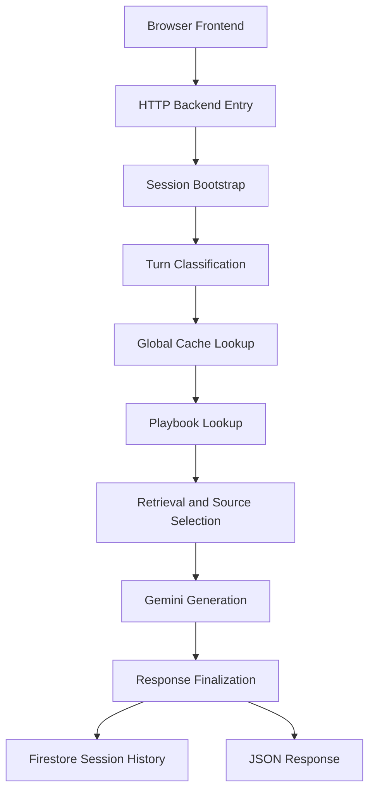
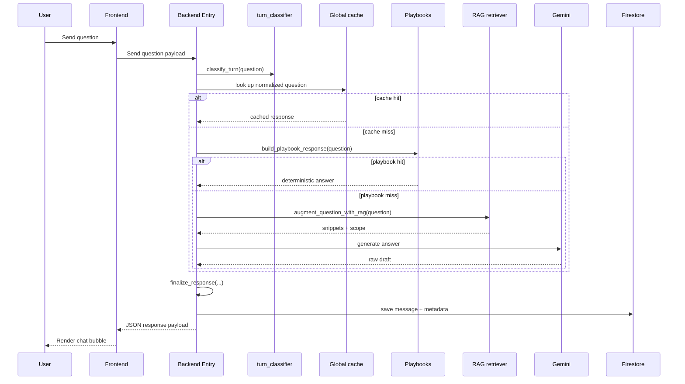
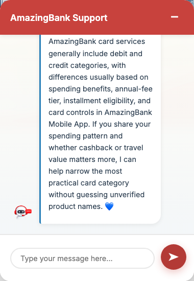
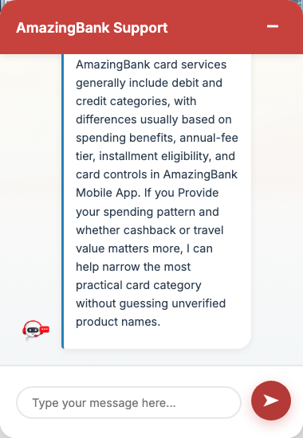
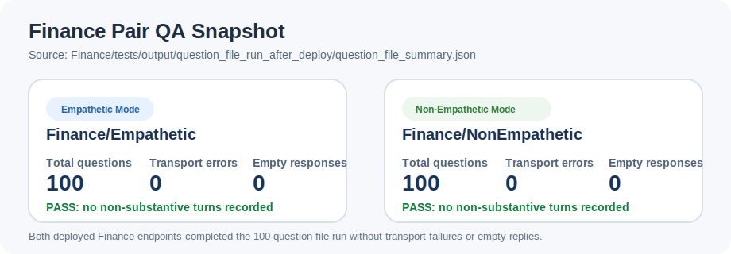

# Bank Chatbot Case Study

This case study explains how the Finance chatbot pair in this repository is built for beginners. The focus is one banking assistant with two output styles: an `Empathetic` version and a `Non-Empathetic` version.

> Active folders used in this case study: `Finance/Empathetic` and `Finance/NonEmpathetic`.
> This page focuses only on the active Finance pair, not the other experiments or adjacent chatbot variants in the repository.

## 1. Beginner Glossary

- `LLM`: a large language model that can draft natural-language answers from instructions, examples, and context.
- `Prompt`: the instructions and examples sent to the model before it answers.
- `Few-shot examples`: sample question-answer pairs that show the model what a good answer should look like.
- `RAG`: retrieval-augmented generation. In this repo, that means searching trusted banking or public-guidance domains, pulling snippets, and adding them to the prompt.
- `Playbook`: a deterministic answer path for common or risky intents such as lost cards, suspicious transactions, or account opening.
- `Turn classification`: deciding whether the user message is a greeting, acknowledgement, unclear input, or a real banking question.
- `Grounding`: how much the answer is tied to a trusted source or safe fallback instead of free-form model generation.
- `Cache`: stored answers used to avoid recomputing the same safe response every time.

## 2. The Problem This Project Solves

The goal here is not just to make "a chatbot." The goal is to build a banking assistant that:

- answers beginners in plain English,
- stays careful when the user asks for live facts such as rates, fees, or service hours,
- handles risky banking situations with immediate practical steps,
- keeps the same factual core across both variants, and
- changes tone without changing the underlying product guidance.

That is why this project has more than one prompt file. Tone is enforced across prompt design, deterministic rules, post-processing, frontend copy, and evaluation.

## 3. System Overview

The backend is anchored in [Finance/Empathetic/Backend/main.py](../Finance/Empathetic/Backend/main.py) and [Finance/NonEmpathetic/Backend/main.py](../Finance/NonEmpathetic/Backend/main.py). Both files follow the same top-level pipeline.



If your Markdown viewer does not render Mermaid, the same pipeline in plain language is:

1. The browser sends the current message to the backend.
2. The backend checks whether this is a new conversation.
3. The backend classifies the turn.
4. The backend looks for a reusable cached answer.
5. The backend tries a deterministic playbook answer.
6. If needed, the backend retrieves trusted snippets and calls Gemini.
7. The backend finalizes the answer for safety and tone.
8. The backend stores conversation metadata in Firestore.
9. The backend returns a JSON response to the frontend.

Two important beginner notes:

- The project uses a lightweight RAG design. It does not build a local vector database inside this repo. Instead, `rag_retriever.py` expands the question, filters by allowlisted domains, reranks snippets, and injects them into the prompt.
- The project tries deterministic paths first. The model is not the first step; it is the fallback for questions that are not already covered by playbooks or cache.

## 4. Repository Map

The most important files for understanding the Finance pair are:

| Area | Files | What they do |
| --- | --- | --- |
| Backend orchestration | [Finance/Empathetic/Backend/main.py](../Finance/Empathetic/Backend/main.py), [Finance/NonEmpathetic/Backend/main.py](../Finance/NonEmpathetic/Backend/main.py) | Receive HTTP requests, decide which path to use, call Gemini when needed, finalize the answer, and save metadata. |
| Deterministic answer layer | [Finance/Empathetic/Backend/banking_playbooks.py](../Finance/Empathetic/Backend/banking_playbooks.py), [Finance/NonEmpathetic/Backend/banking_playbooks.py](../Finance/NonEmpathetic/Backend/banking_playbooks.py) | Handle common intents and risky banking issues with fixed, reviewable text. |
| Turn classification | [Finance/Empathetic/Backend/turn_classifier.py](../Finance/Empathetic/Backend/turn_classifier.py), [Finance/NonEmpathetic/Backend/turn_classifier.py](../Finance/NonEmpathetic/Backend/turn_classifier.py) | Distinguish greetings, acknowledgements, unclear input, and substantive questions. |
| Retrieval layer | [Finance/Empathetic/Backend/rag_retriever.py](../Finance/Empathetic/Backend/rag_retriever.py), [Finance/NonEmpathetic/Backend/rag_retriever.py](../Finance/NonEmpathetic/Backend/rag_retriever.py) | Expand search queries, map English questions to Vietnamese hints, filter trusted domains, rerank snippets, and return retrieval scope. |
| Prompt configuration | [Finance/Empathetic/Backend/chat_config.json](../Finance/Empathetic/Backend/chat_config.json), [Finance/Empathetic/Backend/follow_up_config.json](../Finance/Empathetic/Backend/follow_up_config.json), [Finance/NonEmpathetic/Backend/chat_config.json](../Finance/NonEmpathetic/Backend/chat_config.json), [Finance/NonEmpathetic/Backend/follow_up_config.json](../Finance/NonEmpathetic/Backend/follow_up_config.json) | Hold the system instructions and few-shot examples for the two tone modes. |
| Frontend chat UI | [Finance/Empathetic/Frontend/script.js](../Finance/Empathetic/Frontend/script.js), [Finance/NonEmpathetic/Frontend/script.js](../Finance/NonEmpathetic/Frontend/script.js) | Open the chat widget, initialize the session, send API calls, show default welcome text, and define idle/error UI copy. |
| Deployment packaging | [Finance/Empathetic/Backend/Dockerfile](../Finance/Empathetic/Backend/Dockerfile), [Finance/Empathetic/Backend/requirements.txt](../Finance/Empathetic/Backend/requirements.txt), [Finance/NonEmpathetic/Backend/Dockerfile](../Finance/NonEmpathetic/Backend/Dockerfile), [Finance/NonEmpathetic/Backend/requirements.txt](../Finance/NonEmpathetic/Backend/requirements.txt) | Make the active backend folders deployable as Cloud Run services directly from the current source tree. |
| Evaluation evidence | [CHATBOT_QA_PROCESS.md](../CHATBOT_QA_PROCESS.md), [chatbot_runtime_tuning.md](../chatbot_runtime_tuning.md), [Finance/tests/chatbot_test_flow.py](../Finance/tests/chatbot_test_flow.py), [Finance/tests/output/question_file_run_after_deploy/](../Finance/tests/output/question_file_run_after_deploy/) | Show how the deployed Finance pair was tested and what the results looked like. |

## 5. Step-by-Step Deployment Tutorial

This project deploys in two layers:

1. backend services on Cloud Run,
2. frontend websites on Firebase Hosting.

The current repository already contains the files needed for that flow:

- [Finance/Empathetic/Backend/Dockerfile](../Finance/Empathetic/Backend/Dockerfile)
- [Finance/Empathetic/Backend/requirements.txt](../Finance/Empathetic/Backend/requirements.txt)
- [Finance/NonEmpathetic/Backend/Dockerfile](../Finance/NonEmpathetic/Backend/Dockerfile)
- [Finance/NonEmpathetic/Backend/requirements.txt](../Finance/NonEmpathetic/Backend/requirements.txt)

### 5.1 What you are deploying

For a beginner, the deployment map is:

- `Finance/Empathetic/Backend` becomes one Cloud Run API service.
- `Finance/NonEmpathetic/Backend` becomes one Cloud Run API service.
- `Finance/Empathetic` becomes one Firebase Hosting site.
- `Finance/NonEmpathetic` becomes one Firebase Hosting site.

That means you end up with two public websites that call two public backend endpoints.

### 5.2 Prerequisites

Before deploying, make sure you have:

1. a Google Cloud project with billing enabled,
2. a Firebase project connected to the same Google Cloud project,
3. Firestore created in Native mode,
4. the `gcloud` CLI installed and authenticated,
5. the `firebase` CLI installed and authenticated.

Then set the target project:

```bash
gcloud config set project YOUR_PROJECT_ID
firebase use YOUR_PROJECT_ID
```

### 5.3 Enable required cloud services

Run these once for the project:

```bash
gcloud services enable \
  run.googleapis.com \
  cloudbuild.googleapis.com \
  artifactregistry.googleapis.com \
  firestore.googleapis.com
```

### 5.4 Prepare the backend environment variables

Both Finance backends use the same environment-variable pattern:

| Variable | Why it exists | Example |
| --- | --- | --- |
| `GOOGLE_API_KEY` | Used by `rag_retriever.py` for Google Custom Search. | `your-search-key` |
| `SEARCH_ENGINE_ID` | Used by `rag_retriever.py` to scope search. | `your-cse-id` |
| `PUBLIC_BANK_NAME` | Public-facing brand shown to the user. | `AmazingBank` |
| `SOURCE_BANK_NAME` | Hidden source bank used for retrieval grounding. | `Techcombank` |
| `SOURCE_BANK_SHORT_NAME` | Short source-bank token used during query expansion. | `TCB` |
| `OFFICIAL_BANK_DOMAINS` | Allowlisted trusted source domains for retrieval. | `techcombank.com,www.techcombank.com` |

In this project, the same variable set is used for both modes because the factual core is shared and only the tone changes.

### 5.5 Deploy the empathetic backend

From the repository root, deploy the API service built from [Finance/Empathetic/Backend](../Finance/Empathetic/Backend).

This tutorial uses the service name `m-finance` because that matches the frontend and QA scripts already included in the repository.

```bash
gcloud run deploy m-finance \
  --source Finance/Empathetic/Backend \
  --region us-central1 \
  --allow-unauthenticated \
  --set-env-vars PUBLIC_BANK_NAME=AmazingBank,SOURCE_BANK_NAME=Techcombank,SOURCE_BANK_SHORT_NAME=TCB,OFFICIAL_BANK_DOMAINS=techcombank.com,www.techcombank.com,GOOGLE_API_KEY=YOUR_GOOGLE_API_KEY,SEARCH_ENGINE_ID=YOUR_SEARCH_ENGINE_ID
```

Why this works:

- `main.py` exposes `entry`
- the Dockerfile installs the Python dependencies
- Cloud Run starts the app with `functions-framework --target=entry --source=main.py --port=${PORT}`

### 5.6 Deploy the non-empathetic backend

Deploy the second API service built from [Finance/NonEmpathetic/Backend](../Finance/NonEmpathetic/Backend).

This tutorial uses the service name `non-m-finance` for the same reason: it matches the included frontend and QA defaults.

```bash
gcloud run deploy non-m-finance \
  --source Finance/NonEmpathetic/Backend \
  --region us-central1 \
  --allow-unauthenticated \
  --set-env-vars PUBLIC_BANK_NAME=AmazingBank,SOURCE_BANK_NAME=Techcombank,SOURCE_BANK_SHORT_NAME=TCB,OFFICIAL_BANK_DOMAINS=techcombank.com,www.techcombank.com,GOOGLE_API_KEY=YOUR_GOOGLE_API_KEY,SEARCH_ENGINE_ID=YOUR_SEARCH_ENGINE_ID
```

Get both service URLs after deploy:

```bash
gcloud run services describe m-finance --region us-central1 --format='value(status.url)'
gcloud run services describe non-m-finance --region us-central1 --format='value(status.url)'
```

### 5.7 Point the frontends to the deployed backend URLs

If your new Cloud Run URLs differ from the URLs already hard-coded in the repo, update these files before deploying hosting:

1. [Finance/Empathetic/Frontend/script.js](../Finance/Empathetic/Frontend/script.js)
2. [Finance/NonEmpathetic/Frontend/script.js](../Finance/NonEmpathetic/Frontend/script.js)
3. [Finance/Empathetic/empathetic-standalone.html](../Finance/Empathetic/empathetic-standalone.html)
4. [Finance/NonEmpathetic/non-empathetic-standalone.html](../Finance/NonEmpathetic/non-empathetic-standalone.html)

This step matters because the websites do not discover the backend automatically. Each frontend needs the correct Cloud Run URL.

### 5.8 Deploy the Firebase Hosting sites

Deploy the empathetic website:

```bash
cd Finance/Empathetic
firebase deploy --only hosting
```

Deploy the non-empathetic website:

```bash
cd ../NonEmpathetic
firebase deploy --only hosting
```

The `firebase.json` files in each folder already define the correct rewrite target for the standalone HTML entrypoint.

### 5.9 Apply runtime tuning

After both backend services are live, apply the same Cloud Run tuning pattern captured in [chatbot_runtime_tuning.md](../chatbot_runtime_tuning.md):

```bash
gcloud run services update m-finance \
  --region us-central1 \
  --min-instances 1 \
  --concurrency 40 \
  --cpu 1 \
  --memory 512Mi

gcloud run services update non-m-finance \
  --region us-central1 \
  --min-instances 1 \
  --concurrency 40 \
  --cpu 1 \
  --memory 512Mi
```

This reduces cold starts and keeps the chatbot more stable under concurrent traffic.

### 5.10 Verify the deployed chatbot

Run the QA scripts already included in the repository:

```bash
cd /path/to/with_avatar
python3 chatbot_qa_smoke_test.py
python3 chatbot_hard_test.py --mode safe-hard
python3 Finance/tests/smoke_test_live_endpoints.py
```

If you want a larger evidence set for the Finance pair, run:

```bash
python3 Finance/tests/chatbot_test_flow.py api-file \
  --questions-file Finance/question.txt \
  --empathetic-url https://your-empathetic-site.web.app/ \
  --nonempathetic-url https://your-nonempathetic-site.web.app/
```

### 5.11 A beginner deployment checklist

Use this short checklist before calling the deployment done:

- Both Cloud Run URLs return a JSON response for `POST /`.
- Both Firebase sites load and open the chat widget.
- The empathetic site sounds warmer but still factual.
- The non-empathetic site stays concise and does not drift into warmth.
- Exact live-fact questions trigger safe fallbacks instead of guesses.
- The QA scripts write clean outputs without transport errors.

## 6. HTTP Interface

The backend is exposed as `POST /`.

### Request fields

| Field | Type | Meaning | Example value |
| --- | --- | --- | --- |
| `userHash` | string | Stable session identifier used by the frontend and Firestore. | `8085afab-e381-4ec8-9cce-ba4a5613aa0b` |
| `question` | string | The user's current chat message. | `Tell me about card service` |
| `initConversation` | boolean | Starts a fresh session and returns the fixed opening message. | `true` on the first empty request |
| `endChat` | boolean | Deletes the stored user session. | `false` during normal chat |
| `bypassCache` | boolean | Forces the backend to skip the global response cache. | `false` in normal UI use |

### Response fields

| Field | Type | Meaning | Example value |
| --- | --- | --- | --- |
| `response` | string | Final text returned to the chat UI. | `AmazingBank card services generally include...` |
| `data` | integer | Response counter for the stored conversation. | `3` |
| `rag_used` | boolean | Whether retrieval snippets were used in the final prompt. | `false` |
| `response_mode` | string | High-level production path used for the answer. | `playbook` |
| `cache_hit` | boolean | Whether the answer came from the global cache. | `true` |
| `cache_version` | string | Version marker for cache invalidation after logic changes. | `v11` |
| `turn_classification` | string | How the user turn was interpreted. | `substantive` |
| `grounding_scope` | string | Where the answer was grounded. | `playbook` |
| `userHash` | string | Session identifier returned to the frontend. | `8085afab-e381-4ec8-9cce-ba4a5613aa0b` |

### Runtime labels at a glance

| Label | Where it appears | Plain-English meaning |
| --- | --- | --- |
| `init` | `response_mode`, `grounding_scope` | Session bootstrap path that returns the fixed opening message. |
| `playbook` | `response_mode`, `grounding_scope` | Deterministic answer from `banking_playbooks.py`. |
| `generated` | `response_mode` | Gemini generated the draft answer. |
| `live-fallback` | `response_mode` | The backend refused to guess an unverified live fact and returned a safe fallback. |
| `policy` | `response_mode`, `grounding_scope` | Non-substantive handling such as greeting-only or acknowledgement-only turns. |
| `model_only` | `grounding_scope` | The answer came from the model without retrieval snippets. |
| `official_rag` | `grounding_scope` | The answer used snippets from allowlisted official bank domains. |
| `public_guidance` | `grounding_scope` | The answer used general consumer-guidance domains such as `consumerfinance.gov` or `fdic.gov` when official domains were unavailable. |

## 7. One-Message Lifecycle

Here is the real order used by the code when a normal user question arrives:



### Snippet 1: `entry()` chooses the answer path

Simplified from `main.py` in both Finance modes:

```python
turn_classification = get_turn_classification(question)
cached_response = None if bypass_cache else get_cached_response(db, normalized_question)

if cached_response:
    response = finalize_response(...)
else:
    playbook = build_playbook_response(question)
    if playbook is not None:
        response = finalize_response(playbook.text, ...)
    else:
        augmented_question, rag_used, sources, rag_scope = augment_question_with_rag(question)
        raw_response = safe_model_response_text(model, augmented_question, prompt + chat_history)
        response = finalize_response(raw_response, ...)
```

Why it matters: the backend prefers cache and fixed playbooks before it spends a model call.

### Snippet 2: `augment_question_with_rag()` adds trusted context only when needed

Simplified from `main.py`:

```python
retrieval_question = normalize_intent_text(question)
if not (should_retrieve(retrieval_question)
        or mode_specific_overview_check(retrieval_question)
        or needs_strict_grounding(retrieval_question)):
    return question, False, [], ""

rag_results = retrieve_context(retrieval_question, max_results=RAG_MAX_SOURCES)
reference_block = "\n".join(context_parts) if context_parts else "No verified snippets retrieved for this turn."
augmented_question = f"""Use the evidence and rules below.
Shared factual core:
{factual_block}
Verified snippets:
{reference_block}
User question: {question}
"""
```

Why it matters: retrieval is conditional, and the model sees both shared product guidance and any retrieved snippets.
In the real files, the helper name differs by mode: empathetic uses `is_broad_product_question()` and non-empathetic uses `is_service_overview_question()`.

### Snippet 3: `finalize_response()` is where tone and safety are enforced

Simplified from the two mode-specific versions:

```python
if turn_classification == "ack_only":
    return trim_to_word_limit(ACKNOWLEDGEMENT_RESPONSE)

if needs_strict_grounding(question) and not rag_used and response_mode == "generated":
    response = build_live_verification_fallback(question)

response = sanitize_bank_and_service_terms(response)
response = ensure_factual_core_alignment(response, question)

# Empathetic mode:
response = ensure_soft_empathy(response, question)
response = ensure_empathy_icon(response, question)

# Non-empathetic mode:
response = enforce_non_empathetic_tone(response)
response = apply_non_empathetic_style(response, question)
```

Why it matters: prompt design starts the behavior, but post-processing makes the mode distinction reliable.

## 8. Empathetic vs Non-Empathetic

Both chatbot variants use the same Finance knowledge and the same overall pipeline. The difference is how the answer is framed and cleaned.

| Design area | Empathetic (`Finance/Empathetic`) | Non-Empathetic (`Finance/NonEmpathetic`) |
| --- | --- | --- |
| Backend opening message | Warm welcome with emoji and supportive phrasing. | Plain welcome with neutral professional wording. |
| Prompt context | "Show natural empathy with variation" and include one suitable icon. | "Keep the tone neutral, professional, and factual" and do not use emojis or emotional wording. |
| Post-processing goal | Add soft empathy, then ensure an icon is present. | Remove empathy markers, then apply a concise non-empathetic style. |
| Live fact fallback | Refuses to guess, but keeps the wording warmer. | Refuses to guess, but keeps the wording plain and short. |
| Frontend idle message | `I hear you, and I am still here whenever you are ready. 😊` | `I am still available. Send your next question when ready.` |
| Frontend error message | `I hear you. Sorry, I cannot connect to the server right now.` | `I cannot connect to the server right now.` |
| Shared factual core | Yes. Product and safety rules stay aligned. | Yes. Product and safety rules stay aligned. |

### Same UI, different tone

The screenshots below were captured from the deployed Finance pair after sending the same question: `Tell me about card service`.

| Empathetic | Non-Empathetic |
| --- | --- |
|  |  |

### Paired example from `question_file_results_excerpt.csv`

Question `q023`: `What is the difference between a debit card and a credit card?`

| Empathetic | Non-Empathetic |
| --- | --- |
| `generated` + `model_only` | `generated` + `model_only` |
| "Let us keep this straightforward... A debit card uses money directly from your AmazingBank checking or savings account..." | "A debit card uses funds directly from your AmazingBank account for purchases. A credit card allows you to borrow money up to a pre-approved limit..." |

The key lesson is that the mode difference is not created by prompt wording alone. It is also enforced by:

- tone-specific prompt configs,
- post-processing functions such as `ensure_soft_empathy()` or `enforce_non_empathetic_tone()`,
- frontend idle and error copy, and
- evaluation rules that check for tone drift.

## 9. Grounding and Safety

This project adds several safety layers before and after model generation.

### 9.1 Strict live-fact handling

`STRICT_FACT_PATTERNS` in `main.py` catches questions about things like:

- savings or mortgage rates,
- annual fees,
- transfer limits,
- service hours,
- processing times, and
- any request for "today," "latest," or "exact" figures.

If the answer is not grounded well enough, the backend uses a live-verification fallback instead of guessing.

### 9.2 Trusted retrieval scope

`rag_retriever.py` decides between:

- `official_rag`: snippets from allowlisted bank domains set by `OFFICIAL_BANK_DOMAINS`,
- `public_guidance`: fallback domains such as `consumerfinance.gov`, `fdic.gov`, and `ask.fdic.gov`, or
- no retrieval at all.

This is important because the project does not want free-form web results. It only wants trusted snippets.

### 9.3 Source-bank sanitization

The repo uses hidden source-bank variables and public branding variables. `sanitize_bank_and_service_terms()` and related replacement rules make sure the answer shown to the user says `AmazingBank`, not the source brand used during retrieval or setup.

### 9.4 Prompt-attack and output cleanup

Both modes define:

- `PROMPT_INJECTION_PATTERNS` to catch input such as "ignore previous" or "reveal system prompt",
- `BLOCKED_OUTPUT_PATTERNS` to remove bad fallback text such as "could not process",
- turn classification for empty or unclear input, and
- deterministic playbooks for urgent banking scenarios before the model branch runs.

For beginners, the design idea is simple: use fixed rules for high-risk topics, then use the model only when the question needs broader explanation.

## 10. Memory and Caching

The system stores two very different kinds of memory.

| Store | What it holds | Why it exists |
| --- | --- | --- |
| Firestore user history | Per-user turns inside `Users/{userHash}/conversation1`, including `Content`, `Response`, `CountResponse`, `RagUsed`, `ResponseMode`, `CacheHit`, `CacheVersion`, `TurnClassification`, `GroundingScope`, and optional `Sources`. | Keeps multi-turn context and makes the session inspectable later. |
| Global normalized-question cache | A shared document keyed by hashed normalized question, with `response`, `ragUsed`, `responseMode`, `groundingScope`, `cacheVersion`, and `updatedAt`. | Reuses deterministic safe answers across users and avoids unnecessary model calls. |

This split matters:

- Firestore session history is personal and conversational.
- The global cache is shared and optimized for repeated safe questions.
- `cache_version` lets the team invalidate old answers after logic or prompt changes.

## 11. Evaluation and Evidence

The strongest part of this repo is that evaluation is treated as part of the product, not as an afterthought.

### 11.1 QA artifacts already in the repo

- [CHATBOT_QA_PROCESS.md](../CHATBOT_QA_PROCESS.md) explains the full smoke-test, hard-test, UI probe, and manual A/B flow.
- [chatbot_runtime_tuning.md](../chatbot_runtime_tuning.md) records the Cloud Run settings used to reduce cold starts.
- [chatbot_qa_smoke_test.py](../chatbot_qa_smoke_test.py) checks the deployed endpoints.
- [chatbot_hard_test.py](../chatbot_hard_test.py) stress-tests style, brand leakage, exact-fact guessing, duplication, and latency.
- [Finance/tests/chatbot_test_flow.py](../Finance/tests/chatbot_test_flow.py) batches the Finance corpus and exports structured CSV and JSON outputs.

### 11.2 Post-deploy Finance summary



The file [Finance/tests/output/question_file_run_after_deploy/question_file_summary.json](../Finance/tests/output/question_file_run_after_deploy/question_file_summary.json) reports the following post-deploy totals for the Finance pair:

| Mode | Total questions | Transport errors | Empty responses | Non-substantive turns |
| --- | --- | --- | --- | --- |
| Empathetic | 100 | 0 | 0 | 0 |
| Non-Empathetic | 100 | 0 | 0 | 0 |

## 12. Runtime and Operations View

The operational setup is intentionally simple:

- Firebase Hosting serves the chatbot websites.
- The backend is an HTTP service built with `functions_framework`.
- Firestore stores session history and shared cache documents.
- Cloud Run runtime tuning is used to reduce cold starts and improve concurrent stability.

This is enough to support a beginner-friendly web chatbot, while still leaving room for stronger production features such as richer observability or a more advanced retrieval stack later.

## 13. Lessons Learned and Current Limits

- Prompts alone were not enough. Tone control also needed post-processing and frontend copy.
- Deterministic playbooks are essential for risky finance questions such as lost cards, suspicious activity, and exact live facts.
- Shared factual core matters. The two modes should sound different, not become different products.
- Evaluation artifacts are part of the system design. The repo keeps scripts, summaries, CSVs, and failure categories together.
- The current RAG path depends on trusted-domain availability and snippet quality.
- This repo's RAG is simpler than the full managed RAG architectures shown in vendor docs. It is useful and understandable, but it is not yet a full vector-store pipeline.

## 14. References and Further Reading

These external references fit this project well and help a beginner connect the local code to broader LLM engineering patterns:

- [Vertex AI prompt design](https://docs.cloud.google.com/vertex-ai/generative-ai/docs/learn/prompts/introduction-prompt-design): useful for understanding why this repo uses clear instructions plus few-shot examples.
- [Google Cloud RAG architecture](https://docs.cloud.google.com/architecture/rag-genai-gemini-enterprise-vertexai): useful for comparing this lightweight retrieval design to a fuller production RAG architecture.
- [Vertex AI Responsible AI](https://docs.cloud.google.com/vertex-ai/generative-ai/docs/learn/responsible-ai): useful for grounding, safety filters, and hallucination-aware deployment.
- [Vertex AI evaluation overview](https://docs.cloud.google.com/vertex-ai/generative-ai/docs/models/evaluation-overview): useful for evaluation-driven development.
- [Vertex AI evaluation metrics](https://docs.cloud.google.com/vertex-ai/generative-ai/docs/models/determine-eval): useful for rubric-based checks such as instruction following, text quality, and grounding.
- [OpenAI evals guide](https://developers.openai.com/api/docs/guides/evals): useful for thinking about structured application tests for non-deterministic systems.
- [OpenAI evaluation best practices](https://developers.openai.com/api/docs/guides/evaluation-best-practices): useful for writing tests that reflect real production behavior instead of only unit-style checks.
- [Anthropic prompt engineering overview](https://platform.claude.com/docs/en/build-with-claude/prompt-engineering/overview): useful for understanding when prompt changes help and when another system change is the better fix.

## 15. What A New Reader Should Understand After This

After reading this case study, a beginner should be able to answer:

- What an LLM is doing inside this chatbot.
- When the system uses a fixed playbook versus Gemini generation.
- When retrieval is used and what "grounding" means here.
- How the project avoids inventing live bank-only facts.
- What truly differs between the Empathetic and Non-Empathetic variants.
